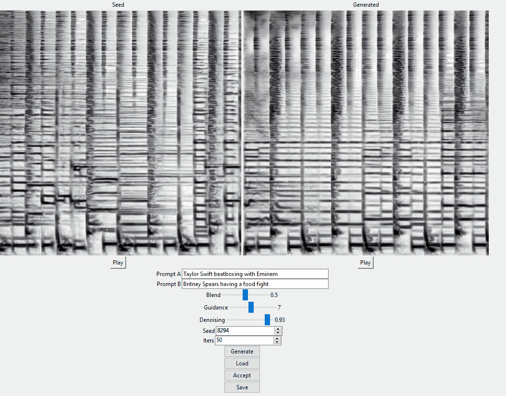

# Riffusion Inference Server

Riffusion is an app for real-time music generation with stable diffusion.

Read about it at https://www.riffusion.com/about and try it at https://www.riffusion.com/.

* Web app: https://github.com/hmartiro/riffusion-app
* Inference server: https://github.com/hmartiro/riffusion-inference
* Model checkpoint: https://huggingface.co/riffusion/riffusion-model-v1

This repository contains the Python backend does the model inference and audio processing, including:

 * a diffusers pipeline that performs prompt interpolation combined with image conditioning
 * a module for (approximately) converting between spectrograms and waveforms
 * a flask server to provide model inference via API to the next.js app
 * a model template titled baseten.py for deploying as a Truss


## Install
Tested with Python 3.9 and diffusers 0.9.0

```
conda create --name riffusion-inference python=3.9
conda activate riffusion-inference
python -m pip install -r requirements.txt
```

## Run
Start the Flask server:
```
python -m riffusion.server --port 3013 --host 127.0.0.1
```

You can specify `--checkpoint` with your own directory or huggingface ID in diffusers format.

The model endpoint is now available at `http://127.0.0.1:3013/run_inference` via POST request.

Example input (see [InferenceInput](https://github.com/hmartiro/riffusion-inference/blob/main/riffusion/datatypes.py#L28) for the API):
```
{
  "alpha": 0.75,
  "num_inference_steps": 50,
  "seed_image_id": "og_beat",

  "start": {
    "prompt": "church bells on sunday",
    "seed": 42,
    "denoising": 0.75,
    "guidance": 7.0
  },

  "end": {
    "prompt": "jazz with piano",
    "seed": 123,
    "denoising": 0.75,
    "guidance": 7.0
  }
}
```

Example output (see [InferenceOutput](https://github.com/hmartiro/riffusion-inference/blob/main/riffusion/datatypes.py#L54) for the API):
```
{
  "image": "< base64 encoded JPEG image >",
  "audio": "< base64 encoded MP3 clip >"
}
```

## Citation

If you build on this work, please cite it as follows:

```
@article{Forsgren_Martiros_2022,
  author = {Forsgren, Seth* and Martiros, Hayk*},
  title = {{Riffusion - Stable diffusion for real-time music generation}},
  url = {https://riffusion.com/about},
  year = {2022}
}
```


## mklingen Changes

This adds the following scripts:

### gui.py


Note that this may have more requirements that I forgot to add to requirements.txt, namely `pyaudio`.

To run, `python -m riffusion.gui`, making sure this dir is in your PYTHONPATH, or running from within this dir.

This is a simple local TKinter gui that can load, save, and iterate on .wav files. Note that the first "generate" step will take a long time, especially if it hasn't downloaded the model yet. Check the console for details.

Please note that .wav files must be 16 bit, mono and exactly 5 seconds long or things might break.

# vst_server.py
This is a server backend for the VST plugin (https://github.com/mklingen/RiffusionVST). Run using

```
python -m riffusion.vst_server
```

from this local directory. Note that this differs from the standard riffusion server because it allows for input of raw .wav data directly from the plugin, and raw .wav data back out.

### riffusion.py
Same as above, but it's a command line interface. Can be used to write a single .wav file. Similar to the flask app, but no web stuff.